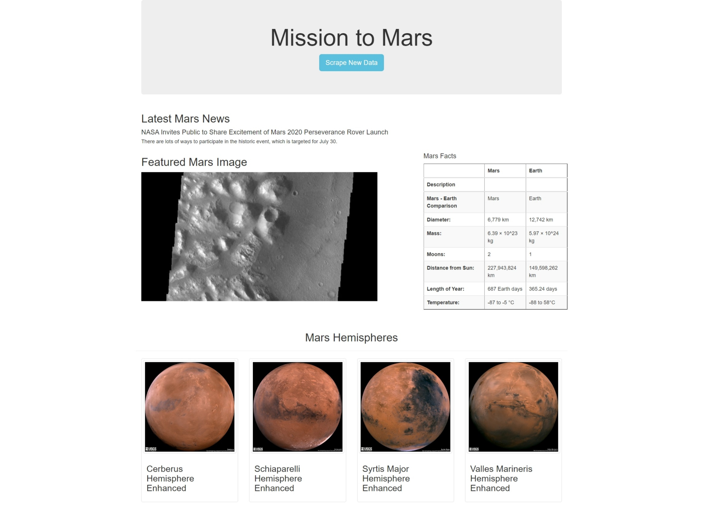

# Mission to Mars

The purpose of this repository is to create a web app that allows users to scrape websites for Mars facts and images, store the data and URLs in a Mongo database, and display them in a responsive, easy to view format.

Running the app.py file, visiting the localhost URL and clicking on the "Scrape New Data" button will cause the script in scraping.py to scrape Mars news and facts from two different websites, as well as high resolution images of all four of Mars's hemispheres from marshemispheres.com.

